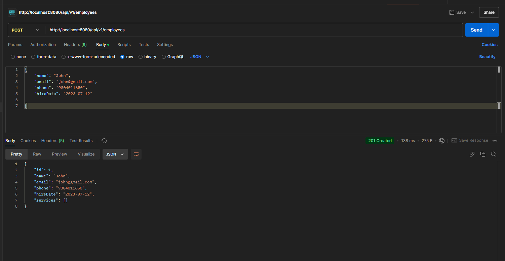
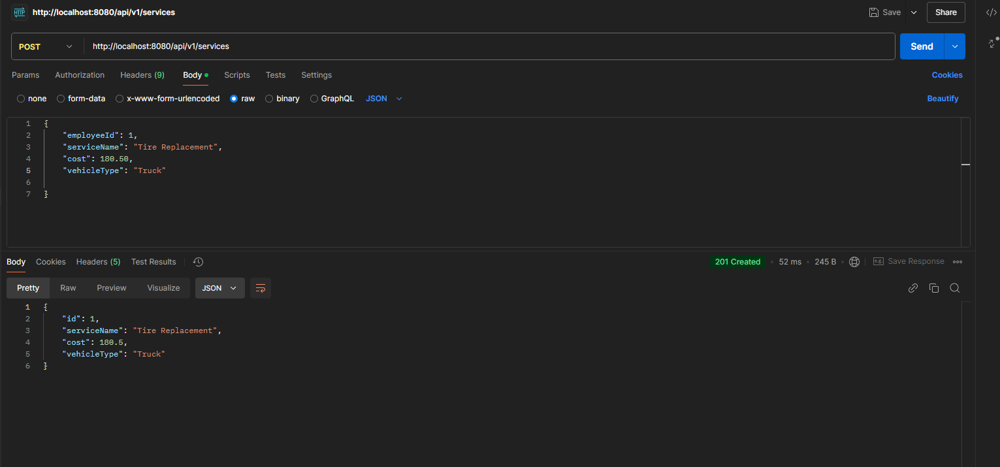
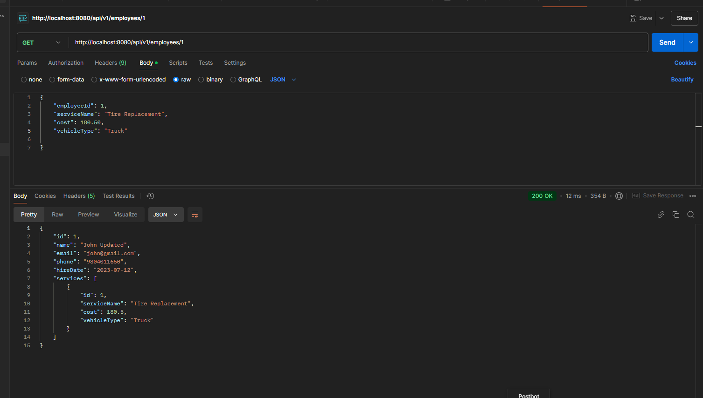
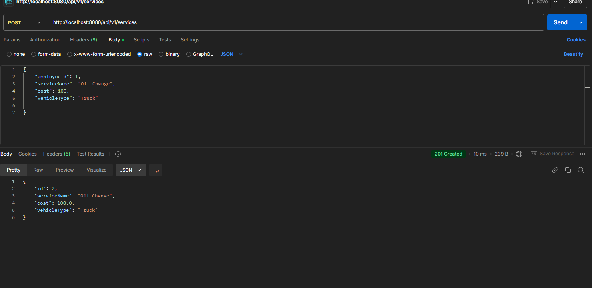
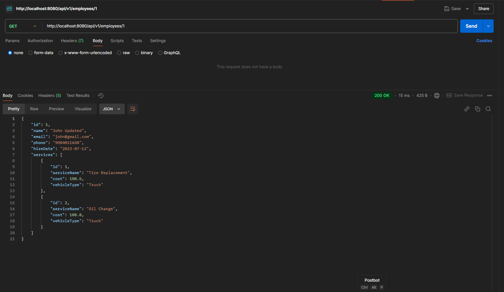
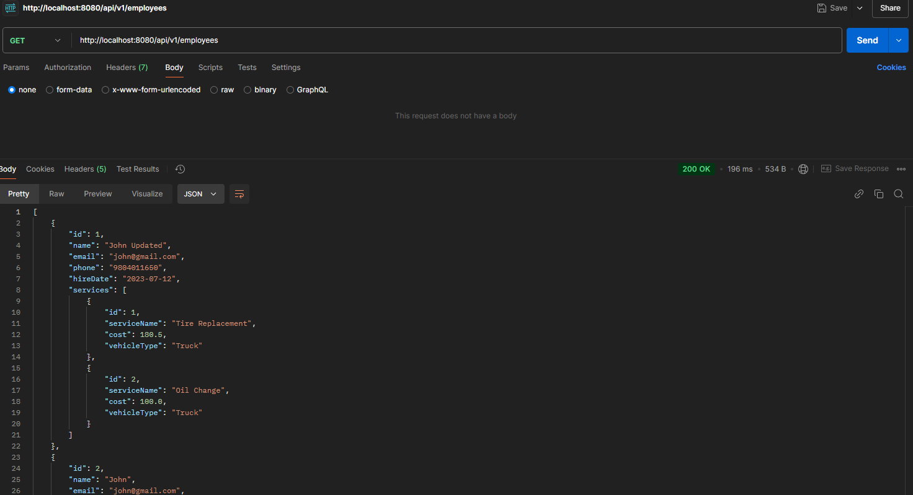
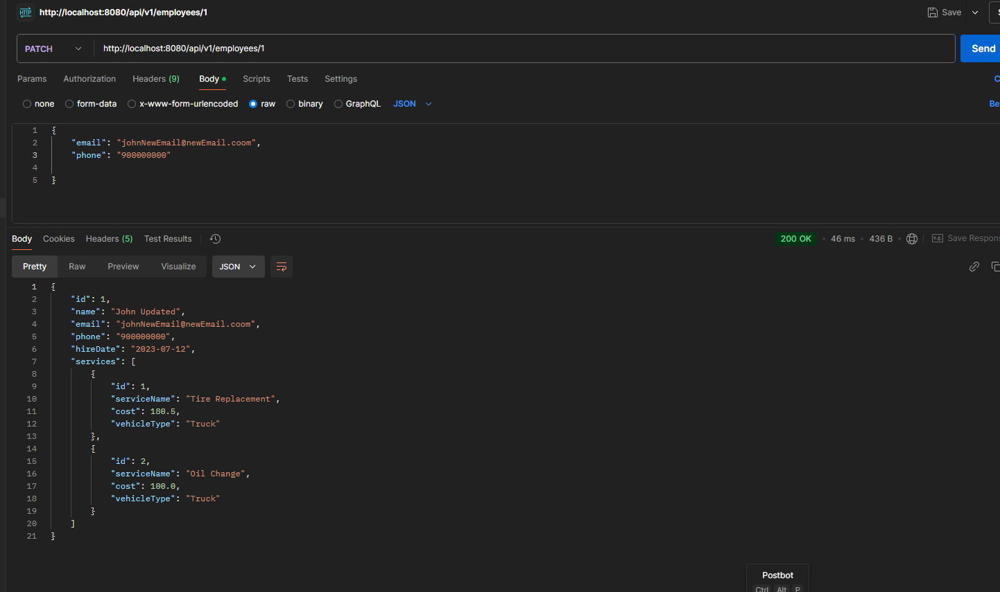

**POST: http://localhost:8080/api/v1/employees**

**POST: http://localhost:8080/api/v1/services**

**GET: http://localhost:8080/api/v1/employees**
**Response**

**POST: http://localhost:8080/api/v1/services**

**GET: http://localhost:8080/api/v1/employees/1**
**Response**

**GET: http://localhost:8080/api/v1/employees**
**Response**

**PATCH: http://localhost:8080/api/v1/employees/1**

